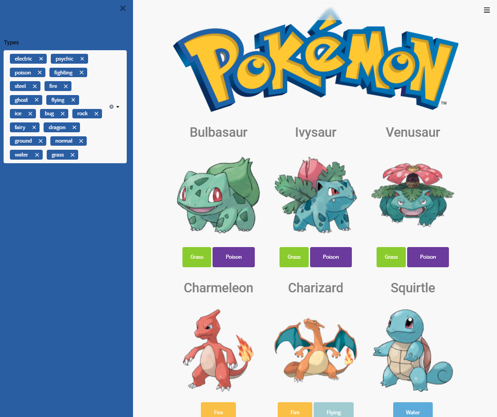

# Pokemon Streamlit

[]()
[](https://share.streamlit.io/ezeparziale/pokemon-streamlit/app/app.py)

Web streamlit listando pokemons.



## :floppy_disk: Instalación

```shell
python -m venv env
```

```shell
source env/bin/activate
```

```shell
pip install -r requirements.txt
```

```shell
python.exe -m pip install --upgrade pip
```

## :running_man: Run

```shell
streamlit run app/app.py
```

```http
http://localhost:8501
```

## :file_folder: Fuente

```http
https://pokeapi.co
```
